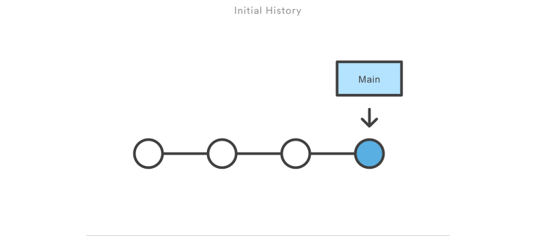

# Git 101 - Gitの簡単な紹介

## Version Control

このセクションの後は、以下の質問に答えていただくことが目的です。

> - [ ] バージョン管理とは？
> - [ ] 変更 (Change)、バージョン (Version)、管理バージョン (Version Control)は？
> - [ ] バージョン管理をしなかった場合はどうなるのか？
> - [ ] バージョン管理はどのように役立つのでしょうか？

<p align="center">

<em>Onedriveのドキュメントレベルの変更履歴</em>
</p>

### Change/Version

> 質問: ファイルを編集すると何が起こるのか？
>
> 回答: ファイルに変更(**Change**)を加えた。多くの変更(**Change**)を加えた後にそのファイルを保存すると、そのファイルの新しいバージョン(**Version**)が作成されます。

フォルダーの中にはたくさんのファイルがあり、プロジェクトの中にはたくさんのフォルダーがあります。すべてのファイルには、それぞれのバージョン履歴があります。

オペレーティングシステム（Linux、Windows、MacOSなど）のファイルマネージャー (File Manager) は、ファイルの最新バージョンしか追跡しないため。ソフトウェア・エンジニアリングのように、変更が多く重要な場合は、プロジェクト・ファイルの履歴をより詳細に記録するバージョン管理システムが必要です。

もし、何かの間違いがあって、その間違いを元に戻したい場合、すべての変更を記録するシステムが必要です。

> **バージョン管理システム**は、コードに加えられたすべての変更を、特殊なデータベースに記録する。

<p align="left">

<em>バージョン管理システムは、プロジェクト全体の開始時点から最新バージョン（青いボール）までのすべての変更点（白いボール）を追跡します</em>
</p>

同じファイルを何人もの人が作っていると、同時に何種類ものバージョンが存在することになります。

バージョン管理システムの開発前は、順番にファイルを変更する必要がありました。現在のファイル編集者が終了するのを待って、ファイルを送信し、それから自分の変更を開始しなければなりません。

*要約すると*

- ファイルを編集するときは、変更(`change`)を作成したことになります。
- 多くの変更(`change`)は、プロジェクトのバージョン(`version`)に結合される可能性があります。
- すべての変更とバージョンを追跡することで、プロジェクトを任意の以前の保存に戻すことができます。
- バージョン管理は、すべての変更点を追跡し、問題が発生した場合は目的のバージョンに戻すのに役立ちます。

---

## Git

## WHAT?

バージョン管理システムのひとつ（ギットと読む）

- ソフトウェア開発において無限にセーブできて
- 各セーブ状態にコメントをつけることができて、
- 任意のセーブ状態に瞬時に戻ったり進んだりできる
- いくらでも分岐できる
- 分岐した歴史を一本に統合することができる

## HOW?

| ソフト | バージョン管理機能| 管理レベル  | 歴史の深さ| 
|:---------|:---------:|:---------:|:---------:|
|OS File System| x |  | 1 |
|OneDrive | o | File | 数名 |
|Git | o | Directory | 全て|

Git は、プロジェクト (Directory)・レベルでのバージョン管理を支援します。

Gitが管理するディレクトリは、Gitリポジトリと呼ばれた。インデックスデータベースは、リポジトリのルートに `.git` ディレクトリとして保存される。

```plain
|...
|- Repository
|- .git/
|- requirements.txt
|- src/
```

この`.git/`フォルダーには、行ったすべての変更とバージョン改訂が保存されますので、絶対に削除しないでください。

*Gitが社内のデータベースをどのように整理しているかを理解したい場合は*ー see this [[LINK]](https://github.com/kdakan/How-Git-Works)

次に、バージョン管理にGitを使用する方法を見ていきます

---
[[MAIN]](../README.md) - [[NEXT: Ch.2 Gitの基本コマンド]](./2-basics.md)
