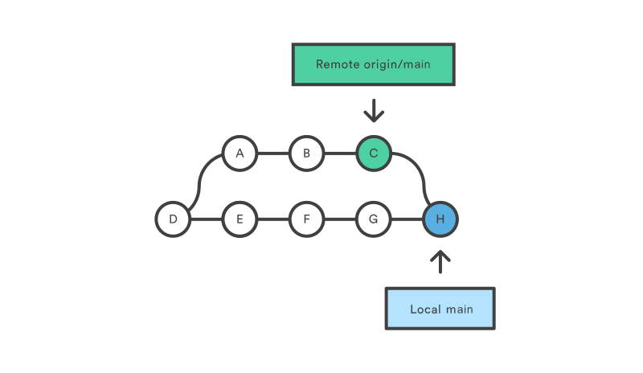

# Gitの基本コマンド

このセクションでは、Gitの基本的なコマンドを紹介します。これらのコマンドは、作業環境において日常的に使用する最も一般的なものです。

`Git`のコマンドはたくさんあり（約`140コマンド`）、高度な概念もあるため、このワークショップの目的は、誰もが研究において基本的に必要なGitを使えるようになるための導入にとどまるものです。

このノートに目標は以下の通り、

- [ ] gitの基本的なコマンドを理解し、使用することができる (`clone`,`init`,`fetch`,`config`,`pull`,`add`,`commit`,`branch`,`checkout`,`diff`)
- [ ] 基本的なコマンドを適用して目的を達成することができる
- [ ] 自分のワークスペースのバージョン管理で一般的なシナリオを理解することができる

## Setup Git

### Gitのインストールを確認

```bash
$ git --version
git version 2.30.2.windows.1
```

### 設定ID

多くのユーザーが同じリポジトリで作業する可能性があるため、すべてのコミットには作者名（ユーザー名とメールアドレス）を含める必要があります。
そのため、将来のコミットに含めるために、自分の情報を git に宣言する必要があります。

```bash
git config --global user.name "John Doe"
git config --global user.email johndoe@example.com
```

<p align="center">

<br>
<em>Fig. 他のチームメンバーがリビジョンの原因を知り、連絡を取るためのユーザー名と電子メール. <br>画像作：あいさん・r-staffing</em>
</p>

### 現在設定を確認

現在のすべての設定を確認するには

```bash
$ git config --list
user.name=John Doe
user.email=johndoe@example.com
color.status=auto
color.branch=auto
color.interactive=auto
color.diff=auto
...
```

詳細については—see [[SCM Book]](https://git-scm.com/book/en/v2/Getting-Started-First-Time-Git-Setup)

---

## Scenario 1

新しいプロジェクトのためにローカルリポジトリを作成したいとします。後は、変更を加えたので、変更内容を確認したい。

対象コマンド: `init`, `add`, `commit`, `log`

1. [新しいgitフォルダの作成](#1-新しいgitフォルダの作成)
2. [リポジトリ内のファイルの状態を確認する](#2-リポジトリ内のファイルの状態を確認する)
3. [変更をコミットにまとめる](#3-変更をコミットにまとめる)
4. [実践編1: git commit](#4-実践編1-git-commit)

### 1. 新しいgitフォルダの作成

```bash
mkdir manga_db
cd manga_db
```

```bash
$ git init
Initialized empty Git repository in /mnt/d/projects/manga_db/.git/
```

初めてローカルの Git リポジトリを作成したところです。しかし、それは空っぽです。

そこで、いくつかのファイルを追加するか、お気に入りのテキストエディタで新しいファイルを作りましょう。そして、先ほど作成したフォルダに保存するか移動させましょう。

最初に `naruto.txt` ファイルを作成します。

```plain
# ./naruto.txt

naruto
sasuke
zoro
sakura
```

そして、次のような内容の `onepiece.txt` ファイルを作成します。

```plain
# ./onepiece.txt

luffy
nami
boa
```

2つのファイルを作成した後、確認してください。

```bash
$ pwd
/mnt/d/projects/manga_db

$ ll
total 0
-rwxrwxrwx 1 elchris elchris 42 Feb 28 23:15 naruto.txt
-rwxrwxrwx 1 elchris elchris 36 Feb 28 23:17 onepiece.txt
```

### 2. リポジトリ内のファイルの状態を確認する

次に、Git の状態をチェックして、それが私たちのレポの一部であるかどうかを確認します。

```bash
$ git status
On branch master

No commits yet

Untracked files:
  (use "git add <file>..." to include in what will be committed)
        naruto.txt
        onepiece.txt

nothing added to commit but untracked files present (use "git add" to track)
```

`git status` は、リポジトリの現在の状態を表示します:

- どの git ブランチ: `On branch **master**`
- 未投稿のコミット一覧: `No commits yet`
- 未トラックのファイル: `Untracked files (naruto.txt, onepiece.txt)`

新しく追加された２つのファイル (i.e., `naruto.txt`, `onepiece.txt`) は、Gitによって認識されましたが、追跡されませんでした。

Gitは追跡しているファイルのバージョン変更のみを監視します。そのため、ユーザーはGitが追跡する必要のあるファイルを宣言しなければなりません。

> Gitのリポジトリフォルダ内のファイルは、2つの状態のいずれかになります:
>
> - Tracked - Gitが知っていて、リポジトリに追加されたファイル
> - Untracked - 作業ディレクトリにあるが、リポジトリに追加されていないファイル

Gitでファイルを追跡するには、次のようにします。

```bash
$ git add naruto.txt
$ git status
On branch master

No commits yet

Changes to be committed:
  (use "git rm --cached <file>..." to unstage)
        new file:   naruto.txt

Untracked files:
  (use "git add <file>..." to include in what will be committed)
        onepiece.txt

$ git add onepiece.txt
...
```

また、すべてのファイルを同時に追加することもできます。

```bash
$ git add .
$ git status
On branch master

No commits yet

Changes to be committed:
  (use "git rm --cached <file>..." to unstage)
        new file:   naruto.txt
        new file:   onepiece.txt
```

> Git フォルダ内の任意の場所に、単一のファイルあるいはディレクトリ全体を追加することができます。

> `.` はカレントディレクトリを表します。
>
> `git add .` は、カレントディレクトリとその子から、追跡されていないファイルをすべて追加することを意味します。

> もし、ルートディレクトリにいないときにすべてのファイルを追加したい場合は、`git add --all` を使用してください。

### 3. 変更をコミットにまとめる

```bash
$ git commit -m "my first commit"
[master (root-commit) 473f896] my first commit
 2 files changed, 11 insertions(+)
 create mode 100644 naruto.txt
 create mode 100644 onepiece.txt
```

Gitがコミットを追跡しているかどうかを確認するには

```bash
$ git log
commit 473f896d358535b5473205c1661a9d40b99382e4 (HEAD -> master)
Author: elchris <nguyenng178@gmail.com>
Date:   Tue Feb 28 23:49:27 2023 +0900

    my first commit
```

すべてのコミットに対しては

- Gitに割り当てられた一意のハッシュで: `...99382e4`
- コミットのブランチ: `(HEAD -> master)`
- 著者名
- コミットメッセージ

### 4. 実践編1: Git Commit

#### 実践編1: 要求事項

1. リポジトリに新しいファイルを追加しました (`toloveru.txt`)。内容については

```plain
# ./toloveru.txt

riku
lala
haruna
```

2. `zoro` の行を `naruto.txt` から `onepiece.txt` に移動する。
3. これら2つの変更をメッセージ付きのコミットにまとめます。(例: `-m "トローベルを追加と間違った世界を修正するゾロ"`)
4. 自分のコミットが Git に記録されているかどうかを確認するには、`git log` を使用します。

*すべての要件が終了したら、次の方法で正しく実行されているかどうかを確認することについては*ーsee [[完成度検証]](#実践編1-完成度検証)

---

#### 実践編1: 完成度検証

必要事項を確認するには、以下の手順に従ってください。

1. リポジトリに3つのファイルがあることを確認します。

```bash
$ ll
total 0
-rwxrwxrwx 1 elchris elchris 42 Feb 28 23:58 naruto.txt
-rwxrwxrwx 1 elchris elchris 36 Feb 28 23:17 onepiece.txt
-rwxrwxrwx 1 elchris elchris 35 Mar  1 09:52 toloveru.txt
```

2. 次に、ゾロはNARUTOではなくONE PIECEにいるべきということで、`naruto.txt`から削除し、`onepiece.txt`に追加することにします。

```bash
$ git status --short
 M naruto.txt
 M onepiece.txt
?? toloveru.txt
```

3.

```bash
$ git log                                                
commit 08849046e901bf9e68476cedb9525abe10bab2dd (HEAD -> master)
Author: ***** <*****>
Date:   *****

    トローベルを追加と間違った世界を修正するゾロ

commit cda059ec679ac7752dc695bb4ac1d92aad3f0472
Author: ***** <*****>
Date:   *****

    my first commit
```

---

## Scenario 2

リポジトリをリモートホストにプッシュする

[[演習1]](#scenario-1)では、ローカルリポジトリを作成しただけで、誰もアクセスできない状態でした。自分の作品をみんなに見てもらうために、通常はリポジトリを公開ホスト（GitHubやGitLabなど）に置くことになります。

対象コマンド: `push`,`checkout`,`branch`,`stash`

### GitHub は?

- リポジトリ共有などが可能なWebサービス（ｷﾞｯﾄﾊﾌﾞ）
- 単なるアップロードの場を超えたコラボレーションの場
  - Gitに不足している機能を補完する役割がある
- 幾多のオープンソース活動がGitHub上で行われてる

<p align="center">

<br>
<em>Fig. GitHubのようなリモートGitリポジトリホストは、リポをインターネット上に公開します。<br>画像作：jlord.us)</em>
</p>

なぜGitHubを使う必要があるのか？

- 誰もがどこからでもあなたのコードにアクセスできる
- ソースコードをオンラインで無料でバックアップできる
- 別のコンピュータに移動した場合は、USBやローカルネットワークでコピーすることなく、プロジェクトのクローンを作成する必要があります。
- 他の研究者のコードにリポジトリからアクセスすることもできます。

### 1. GitHubのリモートリポジトリを作成する

GitHubにアクセスし、`ais-workshop23`という名前で新しいリポジトリを作成します。オプションで `gitignore` や `README` を追加する場合は、チェックを入れないでください。

詳しくはこの[[公式ガイド]](https://docs.github.com/ja/get-started/quickstart/hello-world#creating-a-repository)をご覧ください。

<p align="center">

<br>
<em>Fig. `manga_db`のコードをアップロードするために、リポジトリを作成します。Add a README file`などのオプションにはチェックを入れないでください。</em>
</p>

### 2. ローカルレポを新しく作成されたリモートレポにプッシュ

新しく作成したレポには、GitHub に最初にローカルレポをアップロードする手順が書かれています。

```bash
$ git remote add origin <あなたのGitHubレポのURL>
$ git branch -M main
$ git push -u origin main 
Username for 'https://github.com':
Password for 'https://elchris97@github.com':
```

ローカルリポとGitHubリモートリポをリンクするために、上記の3つのコマンドを使用しました。

- `git remote add origin`: `origin` は GitHub へのリモート URL を表す
- `git branch -M`: 現在のブランチ名を `master` (デフォルト) から `main` (GitHub 標準) に変更する
- `git push -u origin`: 現在のブランチを直接ホストリポジトリにプッシュする場合。

<p align="center">

<br>
<em>Fig. 新しく作成したレポには、GitHub に最初にローカルレポをアップロードする手順が書かれています<br>画像作：masatom.in</em>
</p>

`git push -u origin` の後、現在のブランチを GitHub リポジトリの `main` ブランチにプッシュします。リモートリポジトリへの書き込みは認証された人しかできないので、3つ目のコマンドの後に認証情報を聞かれます。

```bash
$ git push -u origin main 
Username for 'https://github.com':
Password for 'https://elchris97@github.com':
```

認証にはGitHubのユーザー名とパスワードを使用します。パスワードについては、GitHub パーソナルトークンを使用してパスワードを置き換えることが要求されますーsee [[公式ガイド]](https://docs.github.com/ja/authentication/keeping-your-account-and-data-secure/creating-a-personal-access-token#personal-access-token-classic-%E3%81%AE%E4%BD%9C%E6%88%90) - Personal Access Token (Classic) の作成

デフォルトでは、Git はあなたの信用情報を記憶しないので、セキュリティで保護されたリモートリポジトリにプッシュするたびに信用情報を入力しなければなりません。

不便なので、ローカルのGitにパスワードを記憶させるためには、このコマンドを使います。

```bash
git config --global credential.helper store
```

このコマンドを実行すると、最初にリモートリポジトリから pull または push するときに、ユーザー名とパスワードを聞かれます。

その後、リモートリポジトリとの通信では、ユーザー名とパスワードを入力する必要はありません。

保存形式は `.git-credentials` ファイルで、平文で保存されますーsee [stackoverflow](https://stackoverflow.com/questions/35942754/how-can-i-save-username-and-password-in-git)

<p align="center">

<br>
<em>Fig. リモートリポジトリへのプッシュが完了すると、ローカルと同じように git のコミット履歴を確認することができます。</em>
</p>

### 3. ローカルレポを新しく作成されたリモートレポにプッシュ

ローカルリポジトリに変更を加えてからコミットし、新しいコミットを GitHub リポジトリにプッシュします。

1. ローカルの `naruto.txt` ファイルを編集し、変更をコミットします。
2. 新しいコミットをリモートブランチにプッシュします

<p align="center">

<br>
<em>Fig. 最終的な結果は、リモートリポジトリが新しくプッシュされたコミットに更新されたことになります。</em>
</p>

### 4. 他のマシンのリモートリポジトリをクローンする場合

ローカルリポジトリがGitHubに完全にバックアップされていれば、あなたも含めて誰でも自分のマシンにクローンすることができるのです。

プロジェクトを別のコンピューターにクローンするシナリオをシミュレートするために、GitHubのレポをコンピューターの新しい場所にクローンしてみましょう。

1. `manga_db/` ディレクトリから抜け出し、新たに `manga_db_copy/` ディレクトリを作成します。

```plain
.
|-manga_db/
|-manga_db_copy/
```

2. GitHubのレポを `manga_db_copy` リポジトリにクローンする。

```bash
$ git clone https://github.com/elchris97/ais-workshop23.git
Cloning into 'ais-workshop23'...
remote: Enumerating objects: 12, done.
remote: Counting objects: 100% (12/12), done.
remote: Compressing objects: 100% (6/6), done.
remote: Total 12 (delta 0), reused 12 (delta 0), pack-reused 0
Receiving objects: 100% (12/12), done. 
```

3. GitHub のウェブインタフェースで `onepiece.txt` ファイルを再変更してみる。変更後、メッセージを添えてコミットしてください。

<p align="center">

<br>
<em>Fig. 最終的な結果は、リモートリポジトリが新しくプッシュされたコミットに更新されたことになります。</em>
</p>

4. リモートレポとローカルレポの履歴を比較します。両者は異なっていますか？

```bash
$ git log --oneline
afd042b (HEAD -> main, origin/main, origin/HEAD) update naruto
0884904 トローベルを追加と間違った世界を修正するゾロ
cda059e my first commit
```

<p align="center">

<br>
<em>Fig. 最終的な結果は、リモートリポジトリが新しくプッシュされたコミットに更新されたことになります。</em>
</p>

5. オリジン・レポからGitのローカル履歴を更新するには、2つのコマンドがあります。コマンドは `fetch` と `pull` の2つである。

> Git はリモートブランチ (例：`branch-a`) のクローンをローカルリポジトリの `origin/branch-a` として保持します。
>
> ユーザーはこのクローンのコミット履歴ツリーを最新のものに更新し、新しいコミットをリモートリポジトリにプッシュする前に競合を解決する必要があります。

*ここまでの例では、コンフリクトはありません。マージコンフリクトについては、シナリオ3で詳しく説明します。*

これにより、投稿者はローカルブランチとリモートブランチのワークスペース（コミット履歴ツリー）をより柔軟に区別することができます。

<p align="center">

<br>
<em>Fig. ローカルリポジトリは、リモートリポジトリに履歴ログを適用することができます。ローカルリポジトリは、ローカルの履歴を更新するために、リモートの履歴ログを取得することもできます。<br>画像作：masatom.in</em>
</p>

- `git fetch`: リモートからの新しい変更を適用せずに、ローカルのリポジトリ履歴を更新するには。
- `git pull`: `git fetch` と似ていますが、変更をローカルブランチに反映させることができます。

Git では、プッシュする前にローカルリポジトリがリモートから最新の履歴を取得する必要があります。最新のリモート履歴を持たずに (pull で) push コマンドを実行すると、この通知とともにリモートリポジトリから push が拒否されます。

<p align="center">

<br>
<em>Fig. 最新のリモート履歴を持たずに (pull で) push コマンドを実行すると、この通知とともにリモートリポジトリから push が拒否されます。<br>画像作：freecodecamp</em>
</p>

## Mergeとは

ローカルで最新の履歴ログを D ポイント(紫)でプルし、コミット E, F, G を実行します。

同時に、誰かがリモートリポジトリに新しいコミット A, B, C をプッシュしました。

この時点で、Git はあなたの変更 (G) を現在のリモートの変更 (C) と組み合わせずに適用することを許可していません。GとCを結合する動作は、`Git Merge`と呼ばれます。

<p align="center">

<br>
<em>Fig. ローカル (青) とリモート (緑) の両方のレポの履歴ログに新しいコミットがあるとき、ふたつの HEAD を再び同期させるには、ローカルがリモートの HEAD (緑) から情報を取得して (`git fetch`) 新しい変更と現在の変更を一緒にする必要がありました。<br>画像作：atlassian.com/git/tutorials</em>
</p>

<p align="center">

<br>
<em>Fig. 上の図では、新しいコミット H が見えます。このコミットは、リモート A-B-C のコミットの内容を含む新しいマージコミットで、ログメッセージも結合されています。<br>画像作：atlassian.com/git/tutorials</em>
</p>

変更がリモートの変更に影響を与えない場合、2つのHEADは静かにマージされます。しかし、2つの変更が互いに影響しあう場合、後の作者がマージコミットでその衝突を解決しなければなりません。

## Scenario 3

GitHubのウェブインタフェースでファイルを変更し、ウェブ上でコミットします。複数のローカルレポがリモートレポとやりとりしている場合、コンフリクトが発生する可能性がある:

- 複数のマシン（ラップトップとデスクトップ）があり、それぞれにローカルリポジトリがあります。
- 複数人で同じプロジェクトに取り組む。

このような場合、ローカルコードを`pull`ときと`push`ときで齟齬が生じやすいのです。

<p align="center">

<br>
<em>Fig. 既存の同じコード行に2つの変更が発生した場合、マージコンフリクトイベントが発生します。<br>画像作：viblo.asia</em>
</p>

### 1. コンフリクトイベントをシミュレートする

このワークショップではマシンが1台しかないため、2台目としてGitHubのWebを採用します。GitHubのインターフェイスでリポジトリに変更を加えると、コンフリクトを発生させた2番目のユーザを表すことになります。ローカルにあるgitがコンフリクトを解決することになります。

1. GitHubのウェブインタフェースでファイルを変更し、ウェブ上でコミットします。

<p align="center">

<br>
<em>Fig. 例えば、`onepiece.txt`から`boa`の行を削除するようにコミットしました。</em>
</p>

2. ローカルの git で、同じ行に別の変更を加えてください(例:`onepiece.txt`の`boa`行を`boa2`に変更します)。メッセージとともに、この変化をコミットしてください。

```plain
# ./onepiece.txt

luffy
nami
boa2
zoro
```

```bash
$ git log
# 
commit 5d4a94a51ca75c37df7fcc2f2a63287482a132e6 (HEAD -> main)
Author: nguyen.aislab <nguyen.aislab@gmail.com>
Date:   Wed Mar 1 17:11:51 2023 +0900

    update boa

...

$ git diff 5d4a94a~ 5d4a94a
diff --git a/onepiece.txt b/onepiece.txt
index fa97939..c4ff5b3 100644
--- a/onepiece.txt
+++ b/onepiece.txt
@@ -2,5 +2,5 @@
 
 luffy
 nami
-boa
+boa2
 zoro
```

3. このコミットをリモートレポにプッシュしてみてください。現在のHEADがリモートリポジトリの最新コミットより遅れていることが通知されます。

```bash
$ git push
To https://github.com/elchris97/ais-workshop23.git
 ! [rejected]        main -> main (non-fast-forward)
error: failed to push some refs to 'https://github.com/elchris97/ais-workshop23.git'
hint: Updates were rejected because the tip of your current branch is behind
hint: its remote counterpart. Integrate the remote changes (e.g.
hint: 'git pull ...') before pushing again.
hint: See the 'Note about fast-forwards' in 'git push --help' for details.
```

4. この問題を解決するには、リモートリポジトリから最新のHEAD情報を引き出してみてください。メッセージの意味は、「分岐したブランチがあるので、それらを調整する方法を指定する必要があります」。

```bash
$ git pull
hint: You have divergent branches and need to specify how to reconcile them.
hint: You can do so by running one of the following commands sometime before
hint: your next pull:
hint: 
hint:   git config pull.rebase false  # merge (the default strategy)
hint:   git config pull.rebase true   # rebase
hint:   git config pull.ff only       # fast-forward only
hint: 
hint: You can replace "git config" with "git config --global" to set a default
hint: preference for all repositories. You can also pass --rebase, --no-rebase,
hint: or --ff-only on the command line to override the configured default per
hint: invocation.
fatal: Need to specify how to reconcile divergent branches.

```

このケースは、Gitがリモートからの新しい変更と自分のローカルでの変更の違いを黙って解決できないという点で、これまでのシナリオとは異なります。

---

### 2. コンフリクトを解決する

その代わりに、GitはローカルとリモートのHEADの変更を組み合わせるための3つの戦略を提案しています。

```bash
$ git pull
...
hint:   git config pull.rebase false  # merge (the default strategy)
hint:   git config pull.rebase true   # rebase
hint:   git config pull.ff only       # fast-forward only
...
```

1. 古典的なマージを行いたいので、まず `git config pull.rebase false` を実行してから、もう一度 `git pull` を試してみましょう。デフォルトのマージ戦略を3つの戦略から選択します。`merge`,`rebase`,`fast-forward` の3つのストラテジーから選択します。

*(他の2つの戦略は今日は説明しませんが、もし興味があればSlackから気軽に連絡してください。また、このトピックの別のクラスがあれば、ドキュメントを作成します)*

```bash
$ git config pull.rebase false
$ git pull
Auto-merging onepiece.txt
CONFLICT (content): Merge conflict in onepiece.txt
Automatic merge failed; fix conflicts and then commit the result. 
```

ここで、Git は `Merge` 戦略を使ってコンフリクトを解決します。コンフリクトはコンフリクトしたファイルの中で見つかります。どのファイルがコンフリクトしているのかを知るには、`git status`を使います。

2. 再度の引き込みに挑戦

```bash
$ git pull
Auto-merging onepiece.txt
CONFLICT (content): Merge conflict in onepiece.txt
Automatic merge failed; fix conflicts and then commit the result.
```

3. 今度は、Git がリモートリポから正常にプルされました。コンフリクトしている内容は、コンフリクトしているファイルから見つけることができました。コンフリクトしているファイルを表示するには

```bash
$ git status
On branch main
Your branch and 'origin/main' have diverged,
and have 1 and 1 different commits each, respectively.
  (use "git pull" to merge the remote branch into yours)

You have unmerged paths.
  (fix conflicts and run "git commit")
  (use "git merge --abort" to abort the merge)

Unmerged paths:
  (use "git add <file>..." to mark resolution)
 both modified:   onepiece.txt

no changes added to commit (use "git add" and/or "git commit -a")
```

4. コンフリクトを解決し、リモートリポジトリにプッシュする前にマージコンフリクトを作成します。

```bash
$ cat onepiece.txt
# ./onepiece.txt

luffy
nami
<<<<<<< HEAD
boa2
=======
>>>>>>> c007cf6286c2759ff8f28996cccb85430711239e
zoro

```

<p align="center">

<br>
<em>Fig. コンフリクトしたファイルにおけるアノテーションの意味</em>
</p>

5. ローカルでの変更を維持したまま、新しい変更をコミットし、そのコミットを GitHub リポジトリにプッシュすることで、競合を解決してください。

```bash
$ cat onepiece.txt
# ./onepiece.txt

luffy
nami
boa2
zoro

$ git add onepiece.txt

$ git commit -m "対立を解決する"
[main cbca82d] 対立を解決する

$ git push
Enumerating objects: 8, done.
Counting objects: 100% (8/8), done.
Delta compression using up to 12 threads
Compressing objects: 100% (3/3), done.
Writing objects: 100% (4/4), 472 bytes | 472.00 KiB/s, done.
Total 4 (delta 1), reused 0 (delta 0), pack-reused 0
remote: Resolving deltas: 100% (1/1), done.
To https://github.com/elchris97/ais-workshop23.git
   c007cf6..cbca82d  main -> main
```

今回はプッシュが正常に実行されました。

### Repository

リポジトリとは、あるものの倉庫を意味する。

Gitでは、Gitにバージョン管理をさせたいディレクトリにリポジトリを作成します。一台のマシンや一人のユーザーが多くのリポジトリを持つことができます。

マシンにGitソフトウェア（またはGitクライアント）をインストールした後：

- 自分用のリポジトリ（ローカルリポジトリ, `Local Repository`）を作成する
- リモートリポジトリ（`Remote Repository`; `Remote` = `ローカルではない`）をクローンする

### git init

- チームリーダーがプロジェクトのチーム・リポジトリ (`Repository` or `Git Repo.`) を作成
- 自分のマシンにGitシステムをインストールする必要があります。
- すべての貢献者は、元のリポジトリ（またはリモートリポジトリ, `Remote Repository`）を自分のマシンにクローン(`clone`)します。貢献者は自分のローカルリポジト(`Local Repository`)リを変更します。

<p align="center">

<em>`clone` は、自分のマシンにリモートリポジトリのコピーを作成します。</em>
</p>

- 自分のローカルコピーをプロジェクトの最新版(他の貢献者による変更)に更新するには、`git pull`（`pull` = `取って`）を使用します。
- いくつかの変更 (`change`) を行った後、投稿者は変更を意味のあるバージョン・コミット (`commit`) にまとめることができます。
- 多くのコミットを行った後、チームリポジトリに一括でプッシュ (`push`<>`pull`, `push`=`置いて`)することができます。

バージョン管理では、チームメンバー全員がプロジェクトのコピー（ローカルリポジトリ "Local repository"）を持っています。プロジェクトのオリジナルコピー（リモートリポジトリ "Remote Repository"）は、会社のマシンに保管されていました。
