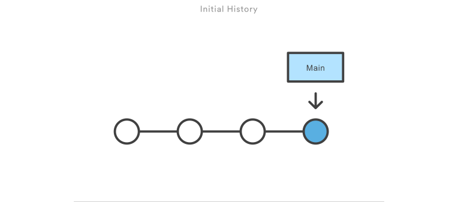

# Gitの基本コマンド

このセクションでは、Gitの基本的なコマンドを紹介します。これらのコマンドは、作業環境において日常的に使用する最も一般的なものです。

`Git`のコマンドはたくさんあり（約`140コマンド`）、高度な概念もあるため、このワークショップの目的は、誰もが研究において基本的に必要なGitを使えるようになるための導入にとどまるものです。

このノートに目標は以下の通り、

- [ ] gitの基本的なコマンドを理解し、使用することができる (`clone`,`init`,`fetch`,`config`,`pull`,`add`,`commit`,`branch`,`checkout`,`diff`)
- [ ] 基本的なコマンドを適用して目的を達成することができる
- [ ] 自分のワークスペースのバージョン管理で一般的なシナリオを理解することができる

## Gitの基本概念

Gitを使うには、まずGitをインストールし、Gitが管理するためのディレクトリを定義する必要があります。

Gitが管理するディレクトリを `Repository` と呼びます。

### Repository

リポジトリとは、あるものの倉庫を意味する。

Gitでは、Gitにバージョン管理をさせたいディレクトリにリポジトリを作成します。一台のマシンや一人のユーザーが多くのリポジトリを持つことができます。

マシンにGitソフトウェア（またはGitクライアント）をインストールした後：

- 自分用のリポジトリ（ローカルリポジトリ, `Local Repository`）を作成する
- リモートリポジトリ（`Remote Repository`; `Remote` = `ローカルではない`）をクローンする

<p align="center">

<em>`clone` は、自分のマシンにリモートリポジトリのコピーを作成します。</em>
</p>

## Push & Pull

<p align="center">

<br>
<em>Fig. `push` (プッシュ) とは、ローカルリポジトリからリモートリポジトリに新しい変更を送信することです。`pull` (プル) は、リモートリポジトリからローカルリポジトリに新しい変更の更新を取得することを意味します。緒にする必要がありました。<br>画像作：atlassian.com/git/tutorials</em>
</p>


---

Gitは、プロジェクトの変更をブランチとコミットで管理します。Gitのバージョン管理機能には、以下のようなものがある:

1. リポジトリ開始時以降の任意の旧バージョンに戻すことができる。
2. すべての変更の意味と誰が変更したかを追跡する機能。
3. 同じコードに複数の人が同時に取り組むことができる。

### Commit

コミット (Commit) とは、リポジトリ内のファイルの主要かつ意味のある変更の集合のことです。

すべてのコミットには、メッセージ（変更の理由）、作者、日付、親が含まれています。

<p align="center">

<br>
<em>Fig. バージョン管理システムは、プロジェクト全体の開始時点から最新バージョン（青い）までのすべての変更点（白い）を追跡</em>
</p>

### Branch

一連のコミットはブランチ（ツリー）を形成する。

最新版のコードは、HEADと呼ばれる最新のコミットで表現されています。

このデザインにより、HEADを過去のコミットに戻すだけで、過去のどのバージョンにも戻すことができるようになりました。

<p align="center">

<br>
<em>Fig. バージョン管理システムは、プロジェクト全体の開始時点から最新バージョン（青い）までのすべての変更点（白い）を追跡</em>
</p>

リポジトリは多くのブランチを持つことができますが、メイン (`main`) ブランチ（またはマスター [`master`] ブランチ）は1つだけです。

<p align="center">

<br>
<em>Fig. ユーザーが master ブランチを変更すると、新しいブランチが作成されます。作業を終えたら、その変更を master ブランチに再リンクします。</em>
</p>

この設計により、多くの人が同じディレクトリで待ち時間なく作業できるようになりました。

### Mergeとは

ローカルで最新の履歴ログを D ポイント(紫)でプルし、コミット E, F, G を実行します。

同時に、誰かがリモートリポジトリに新しいコミット A, B, C をプッシュしました。

この時点で、Git はあなたの変更 (G) を現在のリモートの変更 (C) と組み合わせずに適用することを許可していません。GとCを結合する動作は、`Git Merge`と呼ばれます。

<p align="center">

<br>
<em>Fig. ローカル (青) とリモート (緑) の両方のレポの履歴ログに新しいコミットがあるとき、ふたつの HEAD を再び同期させるには、ローカルがリモートの HEAD (緑) から情報を取得して (`git fetch`) 新しい変更と現在の変更を一緒にする必要がありました。<br>画像作：atlassian.com/git/tutorials</em>
</p>

<p align="center">

<br>
<em>Fig. 上の図では、新しいコミット H が見えます。このコミットは、リモート A-B-C のコミットの内容を含む新しいマージコミットで、ログメッセージも結合されています。<br>画像作：atlassian.com/git/tutorials</em>
</p>

変更がリモートの変更に影響を与えない場合、2つのHEADは静かにマージされます。しかし、2つの変更が互いに影響しあう場合、後の作者がマージコミットでその衝突を解決しなければなりません。

## Setup Git

### Gitのインストールを確認

```bash
$ git --version
git version 2.30.2.windows.1
```

### 設定ID

多くのユーザーが同じリポジトリで作業する可能性があるため、すべてのコミットには作者名（ユーザー名とメールアドレス）を含める必要があります。
そのため、将来のコミットに含めるために、自分の情報を git に宣言する必要があります。

```bash
git config --global user.name "John Doe"
git config --global user.email johndoe@example.com
```

<p align="center">

<br>
<em>Fig. 他のチームメンバーがリビジョンの原因を知り、連絡を取るためのユーザー名と電子メール. <br>画像作：あいさん・r-staffing</em>
</p>

### 現在設定を確認

現在のすべての設定を確認するには

```bash
$ git config --list
user.name=John Doe
user.email=johndoe@example.com
color.status=auto
color.branch=auto
color.interactive=auto
color.diff=auto
...
```

詳細については—see [[SCM Book]](https://git-scm.com/book/en/v2/Getting-Started-First-Time-Git-Setup)

---

## Gitコマンド

### git init

- チームリーダーがプロジェクトのチーム・リポジトリ (`Repository` or `Git Repo.`) を作成
- 自分のマシンにGitシステムをインストールする必要があります。
- すべての貢献者は、元のリポジトリ（またはリモートリポジトリ, `Remote Repository`）を自分のマシンにクローン(`clone`)します。貢献者は自分のローカルリポジト(`Local Repository`)リを変更します。

- 自分のローカルコピーをプロジェクトの最新版(他の貢献者による変更)に更新するには、`git pull`（`pull` = `取って`）を使用します。
- いくつかの変更 (`change`) を行った後、投稿者は変更を意味のあるバージョン・コミット (`commit`) にまとめることができます。
- 多くのコミットを行った後、チームリポジトリに一括でプッシュ (`push`<>`pull`, `push`=`置いて`)することができます。

バージョン管理では、チームメンバー全員がプロジェクトのコピー（ローカルリポジトリ "Local repository"）を持っています。プロジェクトのオリジナルコピー（リモートリポジトリ "Remote Repository"）は、会社のマシンに保管されていました。
