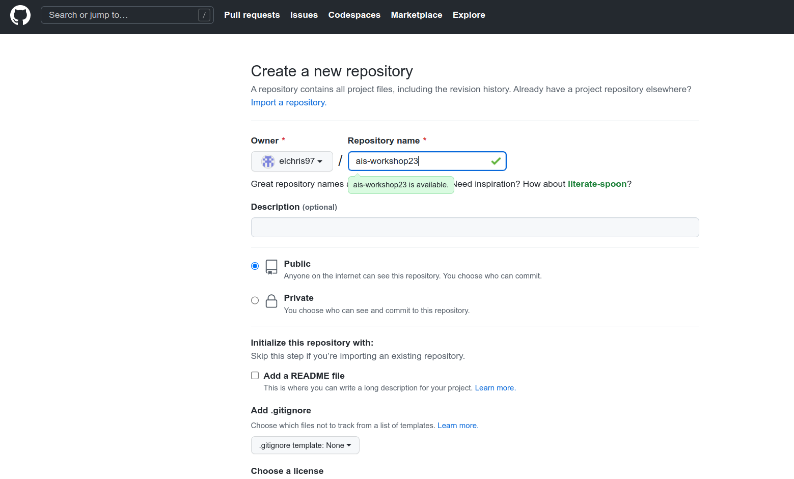
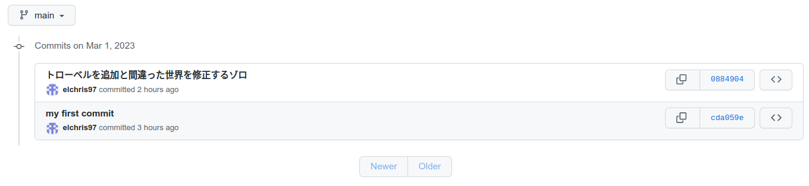

# Scenario 2

リポジトリをリモートホストにプッシュする

[[演習1]](#scenario-1)では、ローカルリポジトリを作成しただけで、誰もアクセスできない状態でした。自分の作品をみんなに見てもらうために、通常はリポジトリを公開ホスト（GitHubやGitLabなど）に置くことになります。

このシナリオでは、GitHubのリポジトリを新規に作成し、それを使ってローカルリポジトリとリンクする方法を練習します。

対象コマンド: `push`,`checkout`,`branch`,`stash`

## GitHub は?

- リポジトリ共有などが可能なWebサービス（ｷﾞｯﾄﾊﾌﾞ）
- 単なるアップロードの場を超えたコラボレーションの場
  - Gitに不足している機能を補完する役割がある
- 幾多のオープンソース活動がGitHub上で行われてる

<p align="center">

<br>
<em>Fig. GitHubのようなリモートGitリポジトリホストは、リポをインターネット上に公開します。<br>画像作：jlord.us)</em>
</p>

なぜGitHubを使う必要があるのか？

- 誰もがどこからでもあなたのコードにアクセスできる
- ソースコードをオンラインで無料でバックアップできる
- 別のコンピュータに移動した場合は、USBやローカルネットワークでコピーすることなく、プロジェクトのクローンを作成する必要があります。
- 他の研究者のコードにリポジトリからアクセスすることもできます。

## 1. GitHubのリモートリポジトリを作成する

GitHubにアクセスし、`ais-workshop23`という名前で新しいリポジトリを作成します。オプションで `gitignore` や `README` を追加する場合は、チェックを入れないでください。

詳しくはこの[[公式ガイド]](https://docs.github.com/ja/get-started/quickstart/hello-world#creating-a-repository)をご覧ください。

<p align="center">

<br>
<em>Fig. `manga_db`のコードをアップロードするために、リポジトリを作成します。Add a README file`などのオプションにはチェックを入れないでください。</em>
</p>

## 2. ローカルレポを新しく作成されたリモートレポにプッシュ

新しく作成したレポには、GitHub に最初にローカルレポをアップロードする手順が書かれています。

```bash
$ git remote add origin <あなたのGitHubレポのURL>
$ git branch -M main
$ git push -u origin main 
Username for 'https://github.com':
Password for 'https://elchris97@github.com':
```

ローカルリポとGitHubリモートリポをリンクするために、上記の3つのコマンドを使用しました。

- `git remote add origin`: `origin` は GitHub へのリモート URL を表す
- `git branch -M`: 現在のブランチ名を `master` (デフォルト) から `main` (GitHub 標準) に変更する
- `git push -u origin`: 現在のブランチを直接ホストリポジトリにプッシュする場合。

> GitHubのリポジトリと連携するためには、GitHubのサーバーでユーザー名とセキュリティトークンを使って認証する必要があります。

<p align="center">

<br>
<em>Fig. 新しく作成したレポには、GitHub に最初にローカルレポをアップロードする手順が書かれています<br>画像作：masatom.in</em>
</p>

`git push -u origin` の後、現在のブランチを GitHub リポジトリの `main` ブランチにプッシュします。リモートリポジトリへの書き込みは認証された人しかできないので、3つ目のコマンドの後に認証情報を聞かれます。

```bash
$ git push -u origin main 
Username for 'https://github.com':
Password for 'https://elchris97@github.com':
```

認証にはGitHubのユーザー名とパスワードを使用します。パスワードについては、GitHub パーソナルトークンを使用してパスワードを置き換えることが要求されますーsee [[公式ガイド]](https://docs.github.com/ja/authentication/keeping-your-account-and-data-secure/creating-a-personal-access-token#personal-access-token-classic-%E3%81%AE%E4%BD%9C%E6%88%90) - Personal Access Token (Classic) の作成

デフォルトでは、Git はあなたの信用情報を記憶しないので、セキュリティで保護されたリモートリポジトリにプッシュするたびに信用情報を入力しなければなりません。

不便なので、ローカルのGitにパスワードを記憶させるためには、このコマンドを使います。

```bash
git config --global credential.helper store
```

このコマンドを実行すると、最初にリモートリポジトリから pull または push するときに、ユーザー名とパスワードを聞かれます。

その後、リモートリポジトリとの通信では、ユーザー名とパスワードを入力する必要はありません。

保存形式は `.git-credentials` ファイルで、平文で保存されますーsee [stackoverflow](https://stackoverflow.com/questions/35942754/how-can-i-save-username-and-password-in-git)

<p align="center">

<br>
<em>Fig. リモートリポジトリへのプッシュが完了すると、ローカルと同じように git のコミット履歴を確認することができます。</em>
</p>

## 3. ローカルレポを新しく作成されたリモートレポにプッシュ

ローカルリポジトリに変更を加えてからコミットし、新しいコミットを GitHub リポジトリにプッシュします。

1. ローカルの `naruto.txt` ファイルを編集し、変更をコミットします。
2. 新しいコミットをリモートブランチにプッシュします

<p align="center">

<br>
<em>Fig. 最終的な結果は、リモートリポジトリが新しくプッシュされたコミットに更新されたことになります。</em>
</p>

## 4. 他のマシンのリモートリポジトリをクローンする場合

ローカルリポジトリがGitHubに完全にバックアップされていれば、あなたも含めて誰でも自分のマシンにクローンすることができるのです。

プロジェクトを別のコンピューターにクローンするシナリオをシミュレートするために、GitHubのレポをコンピューターの新しい場所にクローンしてみましょう。

1. `manga_db/` ディレクトリから抜け出し、新たに `manga_db_copy/` ディレクトリを作成します。

```plain
.
|-manga_db/
|-manga_db_copy/
```

2. GitHubのレポを `manga_db_copy` リポジトリにクローンする。

```bash
$ git clone https://github.com/elchris97/ais-workshop23.git
Cloning into 'ais-workshop23'...
remote: Enumerating objects: 12, done.
remote: Counting objects: 100% (12/12), done.
remote: Compressing objects: 100% (6/6), done.
remote: Total 12 (delta 0), reused 12 (delta 0), pack-reused 0
Receiving objects: 100% (12/12), done. 
```

3. GitHub のウェブインタフェースで `onepiece.txt` ファイルを再変更してみる。変更後、メッセージを添えてコミットしてください。

<p align="center">

<br>
<em>Fig. 最終的な結果は、リモートリポジトリが新しくプッシュされたコミットに更新されたことになります。</em>
</p>

4. リモートレポとローカルレポの履歴を比較します。両者は異なっていますか？

```bash
$ git log --oneline
afd042b (HEAD -> main, origin/main, origin/HEAD) update naruto
0884904 トローベルを追加と間違った世界を修正するゾロ
cda059e my first commit
```

<p align="center">

<br>
<em>Fig. 最終的な結果は、リモートリポジトリが新しくプッシュされたコミットに更新されたことになります。</em>
</p>

5. オリジン・レポからGitのローカル履歴を更新するには、2つのコマンドがあります。コマンドは `fetch` と `pull` の2つである。

> Git はリモートブランチ (例：`branch-a`) のクローンをローカルリポジトリの `origin/branch-a` として保持します。
>
> ユーザーはこのクローンのコミット履歴ツリーを最新のものに更新し、新しいコミットをリモートリポジトリにプッシュする前に競合を解決する必要があります。

*ここまでの例では、コンフリクトはありません。マージコンフリクトについては、シナリオ3で詳しく説明します。*

これにより、投稿者はローカルブランチとリモートブランチのワークスペース（コミット履歴ツリー）をより柔軟に区別することができます。

<p align="center">

<br>
<em>Fig. ローカルリポジトリは、リモートリポジトリに履歴ログを適用することができます。ローカルリポジトリは、ローカルの履歴を更新するために、リモートの履歴ログを取得することもできます。<br>画像作：masatom.in</em>
</p>

- `git fetch`: リモートからの新しい変更を適用せずに、ローカルのリポジトリ履歴を更新するには。
- `git pull`: `git fetch` と似ていますが、変更をローカルブランチに反映させることができます。

Git では、プッシュする前にローカルリポジトリがリモートから最新の履歴を取得する必要があります。最新のリモート履歴を持たずに (pull で) push コマンドを実行すると、この通知とともにリモートリポジトリから push が拒否されます。

<p align="center">

<br>
<em>Fig. 最新のリモート履歴を持たずに (pull で) push コマンドを実行すると、この通知とともにリモートリポジトリから push が拒否されます。<br>画像作：freecodecamp</em>
</p>

---
[[MAIN]](../README.md) - [[BACK: Ch.2 Gitの基本コマンド]](./2-basics.md)